##############################################################################
progressbar2
##############################################################################

A mature, typed terminal progress bar library for Python scripts that need
custom widgets, clean output around prints and logs, multiple concurrent bars,
unknown-length progress, and pipe-friendly CLI usage.

.. image:: https://github.com/WoLpH/python-progressbar/actions/workflows/main.yml/badge.svg
    :alt: python-progressbar test status
    :target: https://github.com/WoLpH/python-progressbar/actions

.. image:: https://coveralls.io/repos/WoLpH/python-progressbar/badge.svg?branch=master
    :alt: coverage status
    :target: https://coveralls.io/r/WoLpH/python-progressbar?branch=master

Install
==============================================================================

.. code:: sh

    pip install progressbar2

Quick start
==============================================================================

.. code:: python

    import time
    import progressbar

    for item in progressbar.progressbar(range(100), desc='Loading'):
        time.sleep(0.02)

Progress with clean logs
==============================================================================

.. code:: python

    import sys
    import time
    import progressbar

    with progressbar.ProgressBar(
        total=24,
        desc='Build',
        fd=sys.stdout,
        redirect_stdout=True,
        line_breaks=False,
        is_terminal=True,
        enable_colors=True,
        term_width=112,
    ) as bar:
        for step in range(24):
            if step in {8, 16}:
                print(f'log: completed step {step}')
            bar.update(step + 1, force=True)
            time.sleep(0.005)

Multiple bars
==============================================================================

.. code:: python

    import io
    import re
    import progressbar

    fd = io.StringIO()
    multibar = progressbar.MultiBar(
        fd=fd,
        total=24,
        enable_colors=True,
        initial_format=None,
        finished_format=None,
        remove_finished=None,
        sort_reverse=False,
        term_width=112,
    )
    build = multibar['build']
    test = multibar['test']
    terminal_control_re = re.compile(r'\x1b\[[0-9;]*[A-Za-ln-z]')

    def emit_frame():
        output = terminal_control_re.sub('', fd.getvalue())
        for line in output.split('\r'):
            line = line.strip()
            if line:
                print(line)
        print('\f', end='')
        fd.seek(0)
        fd.truncate(0)

    multibar.render(force=True, flush=True)
    emit_frame()

    for step in range(24):
        build.update(step + 1, force=True)
        test_value = min(24, max(0, round((step - 3) * 1.2)))
        test.update(test_value, force=True)
        multibar.render(force=True, flush=True)
        emit_frame()

Unknown length and animated bars
==============================================================================

.. code:: python

    import sys
    import progressbar

    with progressbar.ProgressBar(
        max_value=progressbar.UnknownLength,
        fd=sys.stdout,
        line_breaks=False,
        is_terminal=True,
        enable_colors=True,
        term_width=112,
    ) as bar:
        for value in range(0, 120, 10):
            bar.update(value, force=True)

CLI usage
==============================================================================

.. code:: sh

    progressbar --progress --timer --eta --rate --bytes input.bin -o output.bin

Feature highlights
==============================================================================

* Works as an iterable wrapper or a manually updated progress bar.
* Supports custom widgets, colors, granular bars, animated markers, and labels.
* Handles unknown-length iterators.
* Supports multiple concurrent progress bars with ``MultiBar``.
* Redirects stdout/stderr so regular output does not corrupt the active bar.
* Includes a pipe-friendly ``progressbar`` command.
* Ships typed package metadata.

Known terminal caveats
==============================================================================

* JetBrains IDEs need "Enable terminal in output console" for advanced
  terminal behavior such as ``MultiBar``.
* IDLE does not support terminal progress bars.
* Jupyter buffers stdout; call ``sys.stdout.flush()`` when output appears late.

Project history
==============================================================================

progressbar2 is based on the old Python progressbar package that was published
on the now defunct Google Code. Since that project was completely abandoned by
its developer and the developer did not respond to email, I decided to fork the
package.

This package is still backwards compatible with the original progressbar package
so you can safely use it as a drop-in replacement for existing projects.

Links
==============================================================================

* Documentation: https://progressbar-2.readthedocs.org/en/latest/
* Source: https://github.com/WoLpH/python-progressbar
* Bug reports: https://github.com/WoLpH/python-progressbar/issues
* Package homepage: https://pypi.python.org/pypi/progressbar2
