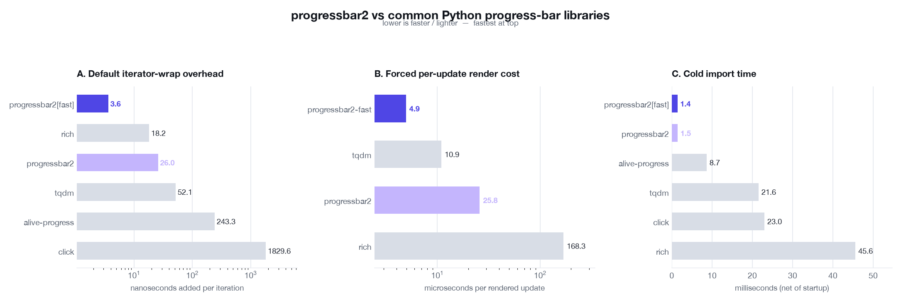

# Python progress-bar library benchmark

_Generated 2026-08-14 12:05. Subject: **progressbar2** (version 4.6.0)._

Compares `progressbar2` against the most common alternatives across three independent dimensions. All rendered output is written to a real pseudo-terminal (pty) that is continuously drained, so every library believes it is attached to a TTY and actually draws — the comparison is apples-to-apples, not "is output suppressed when piped".

## Environment

| | |
|---|---|
| Python | CPython 3.13.12 |
| Platform | macOS-26.5.2-arm64-arm-64bit-Mach-O |
| Processor | arm (18 cores) |
| Terminal | 80x24 (pty) |

| Library | Version |
|---|---|
| progressbar2 | 4.6.0 |
| speedups | 2.3.0 |
| tqdm | 4.68.3 |
| rich | 15.0.0 |
| alive-progress | 3.3.0 |
| click | 8.4.1 |

## A. Default iterator-wrap overhead (headline)

Idiomatic "wrap my loop" call with each library's **default** settings, over **1,000,000** iterations with a trivial body. This is the real-world cost of dropping a progress bar around a fast loop. Overhead = (wrapped time − bare-loop time) / iterations. Lower is faster.

Bare loop baseline: **5.57 ms** for 1,000,000 iterations.

| Library | Total time | Overhead/iter | vs progressbar2 |
|---|--:|--:|--:|
| **progressbar2[fast]** | 9.2 ms | 3.6 ns | 0.14x |
| rich | 23.8 ms | 18.2 ns | 0.70x |
| **progressbar2** | 31.5 ms | 26.0 ns | baseline |
| tqdm | 57.6 ms | 52.1 ns | 2.01x |
| alive-progress | 248.9 ms | 243.3 ns | 9.37x |
| click | 1835.2 ms | 1829.6 ns | 70.47x |

## B. Forced per-update render cost

Rendering **forced on every single update** over **30,000** updates — i.e. the cost of one full bar redraw, throttling disabled. Lower is faster.

| Library | Total time | Per rendered update | vs progressbar2 |
|---|--:|--:|--:|
| **progressbar2-fast** | 148.3 ms | 4.94 us | 0.19x |
| tqdm | 327.6 ms | 10.91 us | 0.42x |
| **progressbar2** | 774.3 ms | 25.80 us | baseline |
| rich | 5049.5 ms | 168.31 us | 6.52x |

Excluded from this panel (no per-update force-render API):
- **alive-progress** — renders on a background timer thread; no per-update render API
- **click** — self-throttles writes (renders only when the drawn line changes); no force-every-update API

## C. Cold import time

Wall-clock cost of importing the library in a fresh interpreter (minimum of 9 runs), with bare-interpreter startup (14 ms) subtracted. Matters for short-lived CLIs. Lower is lighter.

| Library | Import time (net) |
|---|--:|
| **progressbar2[fast]** | 1.4 ms |
| **progressbar2** | 1.5 ms |
| alive-progress | 8.7 ms |
| tqdm | 21.6 ms |
| click | 23.0 ms |
| rich | 45.6 ms |

## Takeaways

- **Default per-iteration overhead:** `progressbar2` is 26 ns/iter, ranking #3 of 6. `progressbar2[fast]` is the lightest per iteration (4 ns), `click` the heaviest (1830 ns).
  - `progressbar2[fast]` wins because the `speedups` C iterator counts natively and only calls back into Python at redraw crossings; a plain `progressbar2` install pays the pure-Python integer gate instead.
- **Render cost:** when a redraw actually happens, `progressbar2` draws one update in 25.8 us — 5.23x the cheapest (`progressbar2-fast`) but 6.5x cheaper than rich's full-display re-render.
- **Why both numbers matter:** `progressbar2` caps redraws at ~20/sec by default (50 ms floor), so in practice the cheap render in B fires rarely and the per-iteration cost in A dominates real workloads.
- **Import weight:** `progressbar2[fast]` is the lightest to import (1.4 ms), `rich` the heaviest (45.6 ms).

## Methodology & caveats

- Timing: `time.perf_counter`, GC disabled during measurement, one untimed warmup per case, **minimum** of N repeats reported (A: 7, B: 5). Minimum is used to reduce scheduler/JIT noise.
- Output goes to a real pty sized 80x24, drained by a background thread so writes never block.
- "Overhead/iter" subtracts the bare-loop baseline, isolating the library's own cost.
- Default settings reflect out-of-the-box behaviour; tuning (`mininterval`, `poll_interval`, etc.) shifts these numbers. Results are specific to the environment above and will vary by machine.
- This measures CPU/throughput overhead only — not feature set, output quality, nesting, or multi-bar support.

Reproduce: `python benchmarks/bench.py && python benchmarks/report.py`
